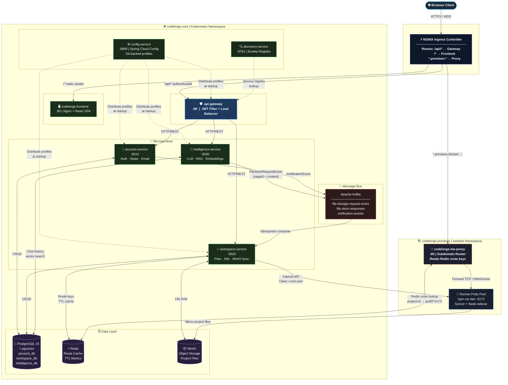

# 🚀 Distributed CodeForge

<div align="center">

<!-- Core Platform -->
[](https://openjdk.org/)
[](https://spring.io/projects/spring-boot)
[](https://spring.io/projects/spring-cloud)
[](https://spring.io/projects/spring-ai)

<!-- Infrastructure -->
[](https://kubernetes.io/)
[](https://www.docker.com/)
[](https://github.com/features/actions)
[](https://cloud.google.com/)

<!-- Data & Messaging -->
[](https://kafka.apache.org/)
[](https://www.postgresql.org/)
[](https://redis.io/)
[](https://min.io/)

<!-- AI & Payments -->
[](https://openrouter.ai/)
[](https://github.com/pgvector/pgvector)
[](https://stripe.com/)

<!-- Frontend -->
[](https://react.dev/)
[](https://vitejs.dev/)
[](https://tailwindcss.com/)

<!-- Meta -->
[](https://opensource.org/licenses/MIT)
[]()
[]()

<br/>

> **A cloud-native, AI-powered collaborative IDE with instant Kubernetes sandbox previews.**
> Build, preview, and ship — all from your browser.

[🎨 Architecture](#-system-architecture) &nbsp;•&nbsp; [📁 Repository Map](#-repository-map) &nbsp;•&nbsp; [⚡ Execution Flows](#-execution-flows) &nbsp;•&nbsp; [🚀 Quick Start](#-quick-start) &nbsp;•&nbsp; [🔄 CI/CD](#-cicd-pipeline) &nbsp;•&nbsp; [📜 API Reference](#-api-reference)

</div>

---

## 📖 Overview

**Distributed CodeForge** is a world-class, cloud-native collaborative IDE and preview sandbox platform. Built on a modular microservices architecture, it enables:

- 💻 **Real-time collaborative coding** — multi-user project access with role-based permissions
- 🧠 **AI-driven code generation** — streaming LLM chat with file edit Sagas, vector context retrieval, and visual bug diagnosis via image uploads
- 🏗️ **Instant Kubernetes sandbox previews** — isolated runner pods with pre-warmed standby pools, MinIO file syncing, and subdomain-based proxy routing
- 💳 **Integrated billing** — Stripe checkout, subscription plans, and token usage enforcement

---

## 🎨 System Architecture

Distributed CodeForge is split into **two Kubernetes namespaces** that are network-isolated from each other:
- `codeforge-core` — the stateless control plane housing all microservices, databases, and the message bus
- `codeforge-previews` — the dynamic sandbox execution plane for isolated runner pods



---

## 📁 Repository Map

| Directory | Sub-component | Port | Responsibility |
| :--- | :--- | :---: | :--- |
| 🛡️ `api-gateway/` | Gateway Router | `80` | Dynamic request routing, JWT security filters, load balancing via Eureka. |
| ⚙️ `config-service/` | Configuration Server | `8888` | Central Git-backed Spring Cloud Config Server distributing profiles to all services. |
| 🔍 `discovery-service/` | Eureka Registry | `8761` | Service registration and discovery for dynamic inter-service resolution. |
| 👤 `account-service/` | Identity & Billing | `9010` | User auth (JWT), Stripe checkout flows, billing portals, and email notifications. |
| 📁 `workspace-service/` | File Engine & K8s | `9020` | Workspace metadata, file trees, MinIO file sync, and Fabric8 sandbox orchestration. |
| 🧠 `intelligence-service/` | AI & Vector Search | `9030` | LLM streaming, chat history, pgvector RAG indexing, and token usage tracking. |
| 📦 `common-lib/` | Shared Library | — | Shared DTOs, Kafka event contracts, JWT models, and global exception handlers. |
| 🌐 `codeforge-frontend/` | React SPA | `80` | Vite/React frontend with real-time chat, file editor, and sandbox preview panel. |
| ☸️ `k8s/` | Deployment Manifests | — | Kubernetes YAML manifests split into `/infra`, `/services`, `/stateful`, and `/proxy`. |

---

## 🛠️ Tech Stack

| Layer | Technology | Version |
| :--- | :--- | :--- |
| **Language** | Java | 21 |
| **Framework** | Spring Boot | 3.5.15 |
| **Microservices** | Spring Cloud (Gateway, Config, Feign, Eureka) | 2025.0.3 |
| **AI Integration** | Spring AI (OpenAI driver via OpenRouter) | 1.1.8 |
| **Frontend** | React + Vite + Tailwind CSS | 18 / 5 / v4 |
| **Database** | PostgreSQL + pgvector extension | 16 |
| **Cache / Routes** | Redis | 7 |
| **Messaging** | Apache Kafka | 3.x |
| **Object Storage** | MinIO | RELEASE.2024 |
| **Orchestration** | Kubernetes (GKE) via Fabric8 | GKE / 7.3.1 |
| **Build / Packaging** | Maven + Google Jib | 3.x / 3.4.3 |
| **Payments** | Stripe SDK | latest |

---

## ⚡ Execution Flows

### 1. Sandbox Preview Claim

```
Browser → api-gateway → workspace-service /projects/{id}/deploy
                                |
              ┌─────────────────┴──────────────────┐
              ▼                                    ▼
       Idle pod available?                  Pool exhausted
              │                                    │
              ▼                                    ▼
     Claim idle pod (IDLE→BUSY)       Evict oldest BUSY pod (LRU)
              │
              ▼
   Syncer sidecar pulls files from MinIO
              │
              ▼
   Runner container: nohup npm run dev (:5173)
              │
              ▼
   Redis key: "route:project-{id}.domain" → podIP:5173
              │
              ▼
   Return preview URL to browser
```

### 2. Event-Driven File Edit Saga

```
[Chat Prompt] → intelligence-service
                      │
                      │ parse <file> XML tags from LLM stream
                      ▼
              FileStoreRequestEvent (sagaId, path, content)
                      │
                      ▼
              Kafka: "file-storage-request-event"
                      │
                      ▼
              workspace-service (idempotency: check sagaId in DB)
                      │
                      ▼
              Save file to MinIO
                      │
                      ▼
              Kafka reply: "file-store-responses" → saga complete
```

### 3. Email Notification Dispatch (Kafka Consumer)

```
Trigger Event                         Kafka Topic                  Consumer
──────────────────────────────────────────────────────────────────────────────
SUBSCRIPTION_CREATED/CANCELLED  ──►  "notification-events"  ──►  account-service
TOKEN_LIMIT_REACHED                                               NotificationEventConsumer
                                                                        │
                                                                        ▼
                                                             JavaMailSender (Brevo SMTP)
```

### 4. RAG Context Injection for AI Chat

1. **File Indexing**: When files are saved, `intelligence-service` receives an internal call to chunk content and index it into `pgvector`.
2. **Query Enrichment**: On each chat request, a `FileTreeContextAdvisor` classifies the intent:
   - Regular queries → semantic search (`topK=5`)
   - Bug reports with image uploads → aggressive retrieval (`topK=10`) + filename matching
3. **Prompt Assembly**: Relevant file chunks are prepended to the LLM system prompt as context before streaming begins.

---

## 🗄️ Database Design

### `account_db`
| Table | Purpose |
| :--- | :--- |
| `users` | Credentials, billing IDs, reset token columns, timestamps |
| `plans` | Billing plan definitions (pricing, token limits, features) |
| `subscriptions` | Maps users to active Stripe subscriptions |
| `stripe_events` | Idempotency store for Stripe webhook event IDs |

### `workspace_db`
| Table | Purpose |
| :--- | :--- |
| `projects` | Project metadata, owner IDs, MinIO bucket assignments |
| `project_files` | File hierarchy metadata and sizes |
| `project_members` | Collaborators with role-based permissions |
| `previews` | Container assignments, status, and endpoints |
| `processed_events` | Saga event log for Kafka idempotency (`sagaId`) |

### `intelligence_db`
| Table | Purpose |
| :--- | :--- |
| `chat_sessions` | Scoped by `userId` + `projectId` composite key |
| `chat_messages` | Full conversation history with raw `content` column |
| `chat_events` | Granular streaming events: `THOUGHT`, `MESSAGE`, `FILE_EDIT`, `TOOL_LOG` |
| `usage_logs` | Daily token tracking per user for quota enforcement |

---

## 📜 API Reference

### Auth (`account-service`)
| Method | Endpoint | Description |
| :---: | :--- | :--- |
| `POST` | `/auth/signup` | Register new user, returns JWT |
| `POST` | `/auth/login` | Authenticate credentials, returns JWT |
| `POST` | `/auth/forgot-password` | Request password reset email |
| `POST` | `/auth/reset-password` | Reset password using reset token |

### Billing (`account-service`)
| Method | Endpoint | Description |
| :---: | :--- | :--- |
| `GET` | `/me/subscription` | Fetch active user subscription |
| `POST` | `/payments/checkout` | Create Stripe Checkout Session |
| `POST` | `/payments/portal` | Create customer billing portal link |
| `POST` | `/webhooks/payment` | Stripe payment webhook receiver |

### Projects (`workspace-service`)
| Method | Endpoint | Description |
| :---: | :--- | :--- |
| `GET` | `/projects` | List all projects user is a member of |
| `POST` | `/projects` | Create a new project workspace |
| `PATCH` | `/projects/{id}` | Edit project metadata |
| `DELETE` | `/projects/{id}` | Soft-delete a project |
| `POST` | `/projects/{id}/deploy` | Claim a sandbox pod and start dev server |
| `GET` | `/projects/{id}/logs` | Stream dev server logs from runner |

### Workspace Files (`workspace-service`)
| Method | Endpoint | Description |
| :---: | :--- | :--- |
| `GET` | `/projects/{id}/files` | Fetch full hierarchical file tree |
| `GET` | `/projects/{id}/files/content` | Fetch file content by relative path |

### Intelligence (`intelligence-service`)
| Method | Endpoint | Description |
| :---: | :--- | :--- |
| `POST` | `/chat/stream` | Stream AI chat (multipart: `message` text + optional `image`) |
| `GET` | `/chat/projects/{projectId}` | Fetch full chat history for a project |
| `POST` | `/internal/v1/embeddings/reindex` | Index file path + content into pgvector |

---

## 🔐 Environment Variables

All services fetch configuration centrally from `config-service`. Secrets are injected at deploy-time via Kubernetes Secrets.

| Variable | Secret Ref | Description |
| :--- | :--- | :--- |
| `JWT_SECRET` | `app-secrets` | HMAC key used for signing and validating JWT tokens |
| `STRIPE_API_KEY` | `app-secrets` | Stripe live/test API key for payment processing |
| `STRIPE_WEBHOOK_SECRET` | `app-secrets` | Signature verification secret for incoming Stripe webhooks |
| `AI_API_KEY` | `app-secrets` | OpenRouter API key for LLM completions |
| `MAIL_USERNAME` | `app-secrets` | SMTP username (Brevo) for transactional email dispatch |
| `MAIL_PASSWORD` | `app-secrets` | SMTP password for transactional email dispatch |
| `CONFIG_SERVER_URL` | ConfigMap | URL of the central Spring Cloud Config Server |
| `PREVIEW_DOMAIN` | ConfigMap | Base domain for sandbox wildcard routes |
| `PREVIEW_NAMESPACE` | ConfigMap | Target namespace for user sandboxes (`codeforge-previews`) |

---

## 🚀 Quick Start

### Prerequisites

| Tool | Min Version | Install |
| :--- | :--- | :--- |
| Java (JDK) | 21 | [adoptium.net](https://adoptium.net/) |
| Maven | 3.9+ | [maven.apache.org](https://maven.apache.org/) |
| Docker Desktop | 4.x+ | [docker.com](https://www.docker.com/products/docker-desktop/) |
| kubectl | 1.28+ | [kubernetes.io](https://kubernetes.io/docs/tasks/tools/) |
| Kind | 0.22+ | [kind.sigs.k8s.io](https://kind.sigs.k8s.io/) |

---

### Option A: Local Cluster with Kind

Run the entire platform locally using **Kind (Kubernetes in Docker)** — no cloud required.

#### Step 1 — Create the Kind Cluster

Create `kind-config.yaml` at the project root:

```yaml
apiVersion: kind.x-k8s.io/v1alpha4
kind: Cluster
nodes:
  - role: control-plane
    kubeadmConfigPatches:
      - |
        kind: InitConfiguration
        nodeRegistration:
          kubeletExtraArgs:
            node-labels: "ingress-ready=true"
    extraPortMappings:
      - containerPort: 80
        hostPort: 80
        protocol: TCP
      - containerPort: 443
        hostPort: 443
        protocol: TCP
```

```bash
kind create cluster --name codeforge --config kind-config.yaml
```

#### Step 2 — Install NGINX Ingress

```bash
kubectl apply -f https://raw.githubusercontent.com/kubernetes/ingress-nginx/main/deploy/static/provider/kind/deploy.yaml

# Wait for ingress controller to be ready
kubectl wait --namespace ingress-nginx \
  --for=condition=ready pod \
  --selector=app.kubernetes.io/component=controller \
  --timeout=90s
```

#### Step 3 — Build Service Images

```bash
# Compile and package all microservices (skip tests for speed)
mvn clean install -DskipTests

# Build Docker images locally using Jib
mvn compile jib:dockerBuild
```

#### Step 4 — Load Images into Kind

```bash
kind load docker-image ankit5609/codeforge-account-service:v1 --name codeforge
kind load docker-image ankit5609/codeforge-workspace-service:v1 --name codeforge
kind load docker-image ankit5609/codeforge-intelligence-service:v1 --name codeforge
kind load docker-image ankit5609/codeforge-frontend:v1 --name codeforge
```

#### Step 5 — Create Kubernetes Secrets

```bash
kubectl create namespace codeforge-core
kubectl create namespace codeforge-previews

kubectl create secret generic app-secrets \
  --from-literal=JWT_SECRET=your_jwt_secret \
  --from-literal=STRIPE_API_KEY=sk_test_... \
  --from-literal=STRIPE_WEBHOOK_SECRET=whsec_... \
  --from-literal=AI_API_KEY=sk-or-v1-... \
  --from-literal=MAIL_USERNAME=your_smtp_user \
  --from-literal=MAIL_PASSWORD=your_smtp_password \
  -n codeforge-core
```

#### Step 6 — Deploy Everything

```bash
# Apply manifests in dependency order
kubectl apply -f k8s/infra/namespaces.yaml
kubectl apply -f k8s/stateful/          # Postgres, Redis, Kafka, MinIO
kubectl apply -f k8s/services/          # All microservices
kubectl apply -f k8s/proxy/             # Subdomain proxy
kubectl apply -f k8s/infra/             # Runner pool, network policies, ingress

# Monitor startup
kubectl get pods -n codeforge-core -w
```

#### Step 7 — Scale Sandbox Pool

```bash
kubectl scale deployment runner-pool --replicas=3 -n codeforge-previews
```

> **Tip**: Add `codeforge.local` and `*.previews.codeforge.local` to your `/etc/hosts` file pointing to `127.0.0.1` to test subdomain routing locally.

---

### Option B: GKE (Production)

For production deployment on Google Kubernetes Engine:

#### Step 1 — Authenticate & Configure

```bash
gcloud auth login
gcloud config set project YOUR_PROJECT_ID
gcloud container clusters get-credentials YOUR_CLUSTER_NAME --region YOUR_REGION
```

#### Step 2 — Build & Push Images via Jib

Jib compiles and pushes images directly to Docker Hub without requiring a local Docker daemon:

```bash
# Authenticate Docker
docker login

# Build and push all services
mvn compile jib:build -Djib.to.image=ankit5609/codeforge-account-service:v1
mvn compile jib:build -Djib.to.image=ankit5609/codeforge-workspace-service:v1
mvn compile jib:build -Djib.to.image=ankit5609/codeforge-intelligence-service:v1

# Build and push frontend manually
docker build --platform linux/amd64 -t ankit5609/codeforge-frontend:v1 codeforge-frontend/
docker push ankit5609/codeforge-frontend:v1
```

#### Step 3 — Create Secrets & Apply Manifests

```bash
kubectl create secret generic app-secrets \
  --from-literal=JWT_SECRET=your_jwt_secret \
  --from-literal=STRIPE_API_KEY=sk_live_... \
  --from-literal=AI_API_KEY=sk-or-v1-... \
  -n codeforge-core

kubectl apply -f k8s/infra/namespaces.yaml
kubectl apply -f k8s/stateful/
kubectl apply -f k8s/services/
kubectl apply -f k8s/proxy/
kubectl apply -f k8s/infra/
```

#### Step 4 — Wake Up Services

```bash
./start-cluster.sh
```

---

## 🔧 Useful Commands

```bash
# Check all pods across namespaces
kubectl get pods -A

# Scale sandbox pool up/down
kubectl scale deployment runner-pool --replicas=5 -n codeforge-previews

# Stream logs from a service
kubectl logs deployment/workspace-service -n codeforge-core -f

# Run database query in-cluster
kubectl exec pgvector-0 -n codeforge-core -- \
  psql -U postgres -d intelligence_db -c "SELECT * FROM chat_messages ORDER BY id DESC LIMIT 5;"

# Force restart a deployment
kubectl rollout restart deployment intelligence-service -n codeforge-core

# Delete the local Kind cluster
kind delete cluster --name codeforge
```

---

## ⚙️ Recent Bug Fixes & Refactoring

| # | Fix | Impact |
| :---: | :--- | :--- |
| 1 | **Actuator Health Recovery** — disabled mail health probe (`management.health.mail.enabled: false`) | Prevented `account-service` crash loops when Brevo SMTP credentials expire |
| 2 | **Subscription NonUniqueResult** — returned list from subscription repo, sorted by highest ID | Fixed Hibernate exception when users had both `DEMO` and `ACTIVE` subscription rows |
| 3 | **Always-FormData Chats** — rebuilt stream client to always use `FormData` format | Fixed `415 Unsupported Media Type` and enabled direct image file uploads |
| 4 | **Trailing-Slash 404** — removed trailing slash from `InternalWorkspaceController` `@RequestMapping` | Fixed Feign client routing to internal workspace endpoints for image uploads |
| 5 | **XML Fallback Parser** — added `MESSAGE`/`FILE_EDIT` event fallback when no XML tags found in raw LLM output | Fixed blank assistant reply bubbles when AI responded with plain Markdown |
| 6 | **ChatEventType Import** — added missing `ChatEventType` enum import in `ChatPanel.tsx` | Fixed `ChatEventType is not defined` ReferenceError that crashed the workspace |

---

## 🛡️ Security

- **Namespace Isolation** — microservices in `codeforge-core`, user sandboxes in `codeforge-previews` (no crossing)
- **Network Policies** — sandbox pods block outbound connections to private RFC ranges (`10.0.0.0/8`, `172.16.0.0/12`, `192.168.0.0/16`)
- **JWT Guard Filters** — all requests validated at the API Gateway via shared Spring Security + `JwtAuthFilter`
- **Database Idempotency** — Stripe webhooks and Kafka Saga edits check event history before execution to prevent double-writes

---

## ⚡ Performance

- **Pre-warmed Pod Pool** — standby runner pods eliminate cold starts; idle pods are claimed in milliseconds instead of spawning new containers
- **Redis Route Cache** — subdomain-to-pod routing stored in Redis for sub-millisecond lookups by the proxy
- **LRU Sandbox Eviction** — when the pool is full, the oldest active pod is reclaimed and recycled to the idle pool
- **Kafka Async Sagas** — file edits are processed asynchronously, preventing AI streaming from blocking on file I/O

---

## 🔄 CI/CD Pipeline

Every microservice has a dedicated **GitHub Actions** workflow that triggers automatically on push to `main` — but **only when files within that service directory change** (path-filtered triggers), avoiding unnecessary builds.

### Workflows

| Workflow File | Trigger Path | Service |
| :--- | :--- | :--- |
| `deploy-account-service.yaml` | `account-service/**` | account-service |
| `deploy-workspace-service.yaml` | `workspace-service/**` | workspace-service |
| `deploy-intelligence-service.yaml` | `intelligence-service/**` | intelligence-service |
| `deploy-config-service.yaml` | `config-service/**` | config-service |
| `deploy-api-gateway.yaml` | `api-gateway/**` | api-gateway |

### Pipeline Stages (per service)

```
git push → main
      │
      ▼
① Checkout code
      │
      ▼
② Set up JDK 21 (Temurin) + Maven cache
      │
      ▼
③ Build common-lib (shared dependency)
      │
      ▼
④ Jib compile → push Docker image to DockerHub
      │   Image tagged: docker.io/ankit5609/<service>:<git-sha>
      │   Also tagged: latest
      │   No Docker daemon needed (Jib builds directly)
      │
      ▼
⑤ Auth to GCP via Workload Identity Federation (keyless — no SA key file)
      │
      ▼
⑥ Get GKE cluster credentials
      │
      ▼
⑦ kubectl set image → rolling update on GKE
      │
      ▼
⑧ kubectl rollout status → pipeline blocks until pods are healthy ✅
```

### Required GitHub Secrets

| Secret | Description |
| :--- | :--- |
| `DOCKERHUB_USERNAME` | Docker Hub username for Jib image push |
| `DOCKERHUB_TOKEN` | Docker Hub access token for Jib image push |
| `GCP_WORKLOAD_IDENTITY_PROVIDER` | GCP Workload Identity Federation provider resource name |
| `GCP_SERVICE_ACCOUNT` | GCP service account email with GKE deploy permissions |
| `GCP_CLUSTER` | Name of your GKE cluster |
| `GCP_ZONE` | Zone/region of your GKE cluster |

> **Keyless Auth**: The pipeline uses [GCP Workload Identity Federation](https://cloud.google.com/iam/docs/workload-identity-federation) instead of long-lived service account JSON keys. The GitHub Actions OIDC token is exchanged for short-lived GCP credentials — no secrets stored on disk.

### Config Server

The `config-service` reads all application profiles from a **dedicated private GitHub repository** (`codeforge-config-server`). Each microservice fetches its environment-specific YAML config (database URLs, API keys, feature flags) from this repo at startup via Spring Cloud Config. Updating config is as simple as pushing to that repo — no service restart required for most settings.

---

## ⚠️ Known Limitations

1. **Single-Instance Databases** — Postgres, Redis, Kafka, and MinIO run as single StatefulSets with no replication or active failover
2. **No Auto-scaling** — the sandbox runner pool must be manually scaled via `kubectl scale` or the `start-cluster.sh` helper
3. **Synchronous PGVector Indexing** — file chunk indexing happens synchronously on save; background batch reindexing is not yet implemented

---

## 📜 License

This project is licensed under the **MIT License** — see the [LICENSE](LICENSE) file for details.

---

<div align="center">

Built with ☕ Java, ⚛️ React, and ☸️ Kubernetes &nbsp;|&nbsp; **Distributed CodeForge**

</div>
