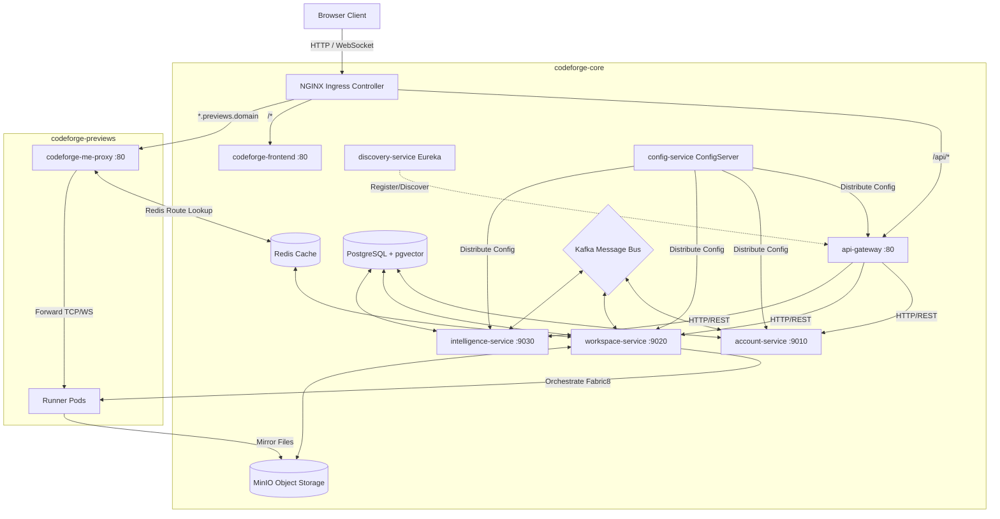

# 🚀 Distributed CodeForge

[](https://openjdk.org/)
[](https://spring.io/projects/spring-boot)
[](https://kubernetes.io/)
[](https://tailwindcss.com/)
[](https://opensource.org/licenses/MIT)

**Distributed CodeForge** is a world-class, cloud-native collaborative IDE and preview sandbox platform. Built on a modular microservices architecture, it enables real-time coding, advanced AI-driven code generation, and instant, secure sandbox previews powered by isolated Kubernetes runner pods.

---

## 🎨 System Architecture

Distributed CodeForge separates its architecture into a core stateless control plane (`codeforge-core`) and an isolated dynamic sandbox execution plane (`codeforge-previews`).



---

## 📁 Repository Map & Responsibilities

| Directory | Sub-component | Responsibility |
| :--- | :--- | :--- |
| 🛡️ `api-gateway/` | Gateway Router | Dynamic request routing, JWT decryption/security filters, rate limiting. |
| ⚙️ `config-service/` | Configuration Server | Central Git-backed Spring Cloud Config Server for profiles administration. |
| 🔍 `discovery-service/` | Eureka Registry | Service discovery backend for inter-service communication. |
| 👤 `account-service/` | Identity & Billing | User authentication, Stripe checkout flows, customer billing portals. |
| 📁 `workspace-service/` | File Engine & K8s | Workspace files database, MinIO object store sync, and Fabric8 sandbox orchestration. |
| 🧠 `intelligence-service/` | AI & Vector Search | LLM chat streaming, chat history logs, and pgvector source indexing. |
| 📦 `common-lib/` | Shared Library | Shared DTOs, Kafka event contracts, JWT validation models, and global exception handlers. |
| ☸️ `k8s/` | Deployment Manifests | Kubernetes resource manifests divided into `/infra`, `/services`, `/stateful`, and `/proxy`. |

---

## 🛠️ Tech Stack & Versions

- **Frameworks**: Spring Boot `3.5.15` / Spring Cloud `2025.0.3` / Spring AI `1.1.8`
- **Frontend**: React 18, Vite, Tailwind CSS v4, daisyUI v5
- **Databases**: PostgreSQL `16` (with `pgvector` extension) & Redis
- **Message Broker**: Apache Kafka (Event-driven Saga architecture)
- **Object Storage**: MinIO (Amazon S3 compatible storage)
- **Orchestration**: Kubernetes (Google Kubernetes Engine) / Fabric8 client `7.3.1`
- **Compiler/Build**: Java 21, Maven compilation (packaged via Google Jib)

---

## ⚡ Execution Flows & Lifecycles

### 1. Dynamic Sandbox Preview Claims
1. **User Request**: User clicks "Run Preview" in the UI.
2. **Control Plane Call**: The client routes the request through NGINX and the API Gateway to `workspace-service` at `/projects/{id}/deploy`.
3. **Pod Allocation**:
   - Fabric8 checks the pre-warmed pod pool in `codeforge-previews`.
   - If an idle pod is available, it claims it and flags its state to `BUSY`.
   - If the pool is empty, the oldest active pod is evicted via an LRU cache algorithm.
4. **File Syncing**: A sidecar container (`syncer`) pulls the project files from MinIO, while the main `runner` container fires `npm run dev` (Vite on port 5173).
5. **Route Mapping**: The pod's virtual IP and port are mapped in Redis under key `"route:project-{id}.previews.domain"`.
6. **Subdomain Proxy**: The proxy service intercepts incoming sandbox traffic and routes it directly to the designated sandbox pod.

### 2. Multi-service Event-Driven Saga (File Edits)
```
[User Chat Prompt] -> (intelligence-service) --[FileStoreRequestEvent]--> (Kafka Topic)
                                                                            |
                                                                            v
(MinIO Storage) <---- [Save File] <---- (workspace-service) <---------------+
```
1. **AI Output Processing**: The LLM output is parsed by the intelligence service to extract file edits (denoted by `<file>` XML tags).
2. **Saga Dispatch**: For each edit, a transactional event (`FileStoreRequestEvent`) containing a unique `sagaId` is dispatched to the `file-storage-request-event` Kafka topic.
3. **Idempotent Storage**: The `workspace-service` consumes the message, ensures it hasn't processed the `sagaId` before (via `ProcessedEventRepository`), writes the updated code to MinIO, and replies with an acknowledgement on the response topic.

---

## ⚙️ Recent Bug Fixes & Refactoring

Distributed CodeForge underwent critical enhancements to resolve scaling blocks, authentication failures, and UI rendering bugs:

1. **Actuator Health Boot Recovery**: Disabled the default Actuator mail provider health probe (`management.health.mail.enabled: false`) to bypass mail container loop crashes caused by expired Brevo credentials.
2. **NonUniqueResult Subscription Resolution**: Resolved database crashes in `account-service` where retrieving multiple active/demo subscriptions for a single user caused Hibernate exceptions. Configured repositories to return lists, sorting by the highest subscription ID.
3. **Always-FormData Stream Chats**: Rebuilt the frontend stream client to package chat requests exclusively as `FormData`. This matches the backend's `multipart/form-data` requirement (enabling direct image uploads) and resolves the `415 Unsupported Media Type` error.
4. **Workspace Trailing-Slash 404 Resolution**: Cleaned up the request mapping prefix in `InternalWorkspaceController.java` by removing trailing slashes (`/internal/v1/` to `/internal/v1`), aligning internal Feign client uploads to prevent routing 404s.
5. **XML Rendering Parser Fallbacks**: Added fallback conditions in the frontend chat panel stream parser. If the LLM generates plain Markdown without XML blocks, the system now automatically wraps the raw text as a `MESSAGE` event, guaranteeing that the assistant's reply always displays correctly.

---

## 🚀 Quick Start & Development

### 1. Build and Run Infrastructure
Ensure Docker Desktop is running. Fire up the local infrastructure stack:
```bash
# From the root directory, start the required databases, redis, kafka, and minio
./start-cluster.sh
```

### 1.1 Local Kubernetes Setup using Kind
To run the full stack locally with matching Kubernetes orchestration, you can spin up a local cluster using **Kind (Kubernetes in Docker)**:

1. **Create Kind Cluster Configuration (`kind-config.yaml`)**:
   Create a cluster mapping host ports 80 and 443 to Kind's ingress container node:
   ```yaml
   apiVersion: kind.x-k8s.io/v1alpha4
   kind: Cluster
   nodes:
   - role: control-plane
     kubeadmConfigPatches:
     - |
       kind: InitConfiguration
       nodeRegistration:
         kubeletExtraArgs:
           node-labels: "ingress-ready=true"
     extraPortMappings:
     - containerPort: 80
       hostPort: 80
       protocol: TCP
     - containerPort: 443
       hostPort: 443
       protocol: TCP
   ```

2. **Boot Cluster**:
   ```bash
   kind create cluster --config kind-config.yaml
   ```

3. **Install NGINX Ingress Controller for Kind**:
   ```bash
   kubectl apply -f https://raw.githubusercontent.com/kubernetes/ingress-nginx/main/deploy/static/provider/kind/deploy.yaml
   ```

4. **Load Local Docker Images (Avoid Registry Pulls)**:
   After compiling microservice images locally, load them directly into Kind:
   ```bash
   kind load docker-image ankit5609/codeforge-frontend:v1
   kind load docker-image ankit5609/codeforge-workspace-service:v1
   ```

5. **Apply Manifests**:
   Apply all config, databases, microservices, and sandbox templates in order:
   ```bash
   kubectl apply -f k8s/infra/namespaces.yaml
   kubectl apply -f k8s/stateful/
   kubectl apply -f k8s/services/
   kubectl apply -f k8s/proxy/
   kubectl apply -f k8s/infra/
   ```


### 2. Build Services
Package all microservices using the Maven wrapper:
```bash
# Package services
mvn clean install -DskipTests

# Build Docker containers via Jib locally
mvn compile jib:dockerBuild
```

### 3. Deploy Sandbox Pool
Scale up the standby pre-warmed pod pool to support instant preview sandboxes:
```bash
kubectl scale deployment runner-pool --replicas=3 -n codeforge-previews
```

---

## 📜 License
This project is licensed under the MIT License - see the LICENSE file for details.
