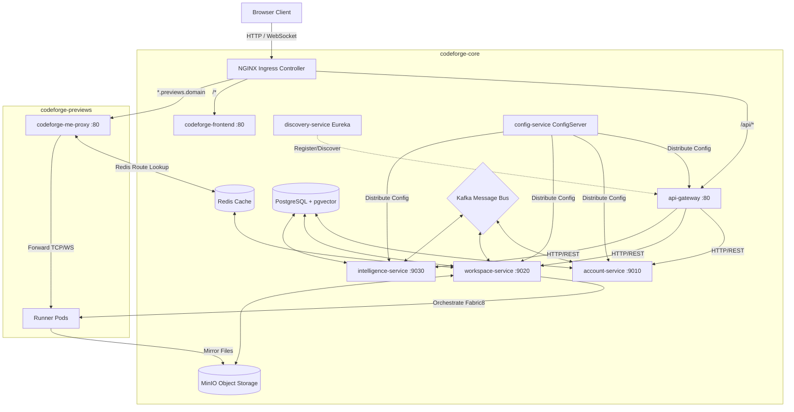

# 🚀 Distributed CodeForge: Comprehensive Brain.md

This document serves as the single source of truth for the **Distributed CodeForge** project, detailing its microservice architecture, LLM streaming pipelines, pgvector-based RAG engines, self-healing runtime compile loops, and Kubernetes orchestrations.

---

## 1. Project Purpose & Core Capabilities
**Distributed CodeForge** is a cloud-native, collaborative IDE and preview sandbox platform designed for developers. The platform enables users to:
1. **Manage projects, write code, and collaborate in real-time**: Multi-user workspace access with full directory layout tracking.
2. **AI-driven Coding & LLM Integration (Spring AI)**: Stream chat replies and file modifications directly inside the workspace using OpenAI drivers via OpenRouter.
3. **Advanced pgvector RAG (Retrieval-Augmented Generation)**: Lightweight project file trees and semantic code retrieval injected as context to guide LLM prompts.
4. **Multimodal Visual Diagnostics & Design Replication**: Input visual screenshot attachments (visual bug diagnostic uploads or design mocks) via `multipart/form-data` endpoints.
5. **Self-Healing Run-time Compile Memory**: AI self-corrects compile/runtime logs from runner pods, archiving successful fix diffs in the vector store for dynamic future assistance.
6. **Isolated Sandbox Previews**: Boot instant preview environments (React/Vite dev servers) directly from the browser inside dedicated Kubernetes namespaces.

---

## 2. High-Level Architecture
The system follows a microservices pattern with an event-driven flow (Kafka) and key-value routing (Redis). Services boot within a private Kubernetes namespace (`codeforge-core`), while user preview sandboxes are created dynamically in a separate namespace (`codeforge-previews`).



---

## 3. Folder Responsibilities

| Directory | Responsibility |
| :--- | :--- |
| `config-service/` | Spring Cloud Config Server mapping configurations from a remote Git repository. |
| `discovery-service/` | Eureka Service Registry for registry lookup and dynamic inter-service resolution. |
| `api-gateway/` | Gateway router implementing JWT security filters and routing rules. |
| `account-service/` | User identities, memberships, Stripe subscription checkout, and webhooks processing. |
| `workspace-service/` | Project metadata, file trees, MinIO storage client, and Fabric8 Kubernetes deployment/sandbox pool manager. |
| `intelligence-service/` | Chat session tracking, token usage logging, and Spring AI OpenAI integrations. |
| `common-lib/` | Shared Java code (JWT validations, exceptions handler, standard Event models, DTOs). |
| `k8s/` | Kubernetes manifests grouped into `infra/`, `proxy/`, `services/`, and `stateful/`. |

---

## 4. Technology Stack & Versions

* **Core Language/Framework**: Java 21, Spring Boot `3.5.15`
* **Microservices & Orchestration**: Spring Cloud `2025.0.3` (Gateway, Config Server, OpenFeign, Eureka Discovery)
* **AI Integration**: Spring AI `1.1.8` (OpenAI model driver)
* **Containers & Orchestration**: Kubernetes (GKE), Docker, Fabric8 client `7.3.1`
* **Databases**:
  * PostgreSQL `16` (running `pgvector` image)
  * Redis (used for route caching and live TTL metrics)
* **Storage**: MinIO Object Storage (Node SDK / Java MinIO client `8.6.0`)
* **Messaging**: Apache Kafka (transactional Sagas, subscription streams)
* **API Documentation**: Springdoc OpenAPI WebMVC UI `2.8.5`
* **Build System**: Maven (via `./mvnw` wrapper per project)

---

## 5. Dependency Graph
```
[api-gateway] ----------> [discovery-service] <---------- [account-service]
     |                                                          |
     v                                                          | (Stripe -> Kafka)
[config-service] <--- (All Services configuration fetch)        v
     ^                                                  [Kafka Message Bus]
     |                                                          ^
[intelligence-service] --(Saga Edit Request)--------------------+
     |                                                          |
     | (OpenFeign)                                              v
     +------------------> [workspace-service] <-----------------+ (Saga Consume Edit)
```

---

## 6. Execution Flow (Startup Sequence)
To boot the cluster, components must be started in order:
1. **Infrastructure Layer**: Start databases, caches, and queues: `pgvector` StatefulSet, `redis`, `kafka`, and `minio`.
2. **Config & Discovery Registry**: Start `config-service` (fetches configurations from Git) followed by `discovery-service` (Eureka registry).
3. **API Routing Gateway**: Start `api-gateway` which logs into Eureka.
4. **Microservices Stateless Layer**: Start `account-service`, `workspace-service`, and `intelligence-service`.
5. **Static Assets & Proxy**: Deploy `codeforge-frontend` and the `codeforge-me-proxy`.
6. **Pre-Warmed Pool**: Scale up the `runner-pool` inside the `codeforge-previews` namespace to maintain standby runner nodes.

---

## 7. Request Lifecycles

### A. Preview Sandbox Claiming
```
Client Request -> api-gateway -> workspace-service (/projects/{id}/deploy)
                                          |
                                    [Claim Pod]
                                          |
                        Is idle pod available in Pool?
                           /                     \
                        (Yes)                    (No)
                         /                         \
            Claim first idle pod           Evict oldest busy pod
                         \                         /
                    [Transition Status: IDLE -> BUSY]
                                          |
              [syncer container] MC mirror pulls files from MinIO
                                          |
              [runner container] nohup npm run dev (Vite :5173)
                                          |
           Redis Key Set: "route:project-123.previews.domain" -> "podIP:5173"
                                          |
                Return Proxy URL (http://project-123.previews.domain)
```

### B. AI File Editing (Event-Driven Saga)
1. **User Prompt**: User requests code modification via Chat.
2. **AI Action Parsing**: `intelligence-service` streams prompt response, saving chat history. It parses output into `ChatEvent`s (e.g. `FILE_EDIT`).
3. **Kafka Dispatch**: For each `FILE_EDIT`, a `FileStoreRequestEvent` containing the file path, new contents, and a unique `sagaId` is dispatched to the `file-storage-request-event` topic.
4. **Idempotent Consume**: `workspace-service` consumes the event. It queries its SQL database using `ProcessedEventRepository` to verify the `sagaId` hasn't been handled.
5. **Save to Storage**: It saves files to MinIO storage and tracks the transaction in `ProcessedEvent` table.
6. **Acknowledge**: It publishes `FileStoreResponseEvent` to `file-store-responses` topic.

### C. Email Notification Dispatch (Kafka Event Consumer)
1. **Event Trigger**: When a key user transition occurs:
   - Subscription is activated (`SUBSCRIPTION_CREATED`)
   - Subscription is cancelled (`SUBSCRIPTION_CANCELLED`)
   - Daily token usage limit is reached (`TOKEN_LIMIT_REACHED`)
2. **Kafka Broadcast**: A `NotificationEvent` containing the type, userId, and message is dispatched to the `"notification-events"` Kafka topic.
3. **Event Consumption**: `NotificationEventConsumer` in `account-service` consumes the message.
4. **User Lookup & Email Dispatch**: The consumer queries the PostgreSQL database to retrieve the user's registered email (`username`) and sends a notification email via `JavaMailSender` using the configured Brevo SMTP server.

---

## 8. Database Design
Database configurations are created in `pgvector` container startup using `/docker-entrypoint-initdb.d/init.sh`.

### Database Schemas

#### A. Account Database (`account_db`)
* **users**: User credentials, billing IDs, resetPasswordToken/resetPasswordTokenExpiresAt columns, and timestamps.
* **plans**: Billing plans definitions (pricing, features, token limitations).
* **subscriptions**: Connects users to active stripe subscriptions.
* **stripe_events**: Tracking unique Stripe Event IDs for idempotency.

#### B. Workspace Database (`workspace_db`)
* **projects**: Project configurations, git urls, owner user IDs, MinIO bucket assignments.
* **project_files**: Metadata about folder contents and sizes.
* **project_members**: Project collaborators and their permission levels.
* **previews**: Status, container mapping, and endpoints.
* **processed_events**: Event logging table for Saga `sagaId` validation.

#### C. Intelligence Database (`intelligence_db`)
* **chat_sessions**: Scoped by user ID and project ID.
* **chat_messages**: Text logs representing conversation states.
* **chat_events**: Thought logs or file modification events generated by messages.
* **usage_logs**: Tracks daily tokens spent per user to apply limit validations.

---

## 9. API Contracts

### Authentication (`account-service` / `/auth`)
* `POST /auth/signup` - Register user. Body: `SignUpRequest`. Returns: JWT Token.
* `POST /auth/login` - Authenticate credentials. Body: `LoginRequest`. Returns: JWT Token.
* `POST /auth/forgot-password` - Request a password reset token. Body: `ForgotPasswordRequest`.
* `POST /auth/reset-password` - Reset password using the reset token. Body: `ResetPasswordRequest`.

### Billing (`account-service` / `/payments` & `/me`)
* `GET /me/subscription` - Fetch active user subscription.
* `POST /payments/checkout` - Create Stripe Checkout Session. Returns: Redirect URL.
* `POST /payments/portal` - Create customer billing portal link.
* `POST /webhooks/payment` - Stripe payment webhook.

### Projects (`workspace-service` / `/projects`)
* `GET /projects` - List all projects user is member of.
* `POST /projects` - Create a project workspace. Body: `ProjectRequest`.
* `PATCH /projects/{id}` - Edit project meta details.
* `DELETE /projects/{id}` - Soft-delete project workspace.
* `POST /projects/{id}/deploy` - Claim sandbox pod, configure sync, and run dev server. Parameters: `force` (bool).
* `GET /projects/{id}/logs` - Stream development server logs from runner files.

### Workspace Files (`workspace-service` / `/projects/{id}/files`)
* `GET /projects/{id}/files` - Fetch full hierarchy file tree.
* `GET /projects/{id}/files/content` - Fetch file content by relative path.

### Intelligence (`intelligence-service` / `/chat` & `/internal`)
* `POST /chat/stream` - Stream chat replies. Accepts multipart request with optional `message` (text), optional `image` (file upload), and required `projectId`. Content-Type: `multipart/form-data`.
* `GET /chat/projects/{projectId}` - Get chat history logs.
* `POST /internal/v1/embeddings/reindex` - Index a file path and content into pgvector.


---

## 10. Environment Variables & Configurations

All environments fetch settings from the `config-service`. Key variables injected at deploy-time:

| Env Variable | Origin/Secret Reference | Description |
| :--- | :--- | :--- |
| `JWT_SECRET` | `app-secrets:JWT_SECRET` | Secret key used for parsing user credentials. |
| `STRIPE_API_KEY` | `app-secrets:STRIPE_API_KEY` | Stripe integration key. |
| `STRIPE_WEBHOOK_SECRET` | `app-secrets:STRIPE_WEBHOOK_SECRET` | Verification secret for stripe webhook incoming calls. |
| `AI_API_KEY` | `app-secrets:AI_API_KEY` | Key for OpenAI endpoint interactions. |
| `CONFIG_SERVER_URL` | ConfigMap | URL of the central Cloud Config Server. |
| `PREVIEW_DOMAIN` | ConfigMap | Base domain used for sandbox wildcard routes. |
| `PREVIEW_NAMESPACE` | ConfigMap | Destination namespace for user sandboxes (`codeforge-previews`). |

---

## 11. Security Practices

1. **Namespace Isolation**: Microservices reside in `codeforge-core`, whilst user sandboxes exist inside `codeforge-previews` to prevent namespace crossing.
2. **Network Egress Constraints**: Previews block outbound connections to common private network ranges (`10.0.0.0/8`, `192.168.0.0/16`, `172.16.0.0/12`) to prevent sandbox users from hacking other internal databases/services.
3. **JWT Guard Filters**: Shared Spring Security configuration checks tokens at the `api-gateway` level and sets matching authority roles.
4. **Database Idempotency**: Stripe Webhook transactions and Kafka Saga edits check event history in DB before execution to avoid double operations.

---

## 12. Performance Considerations
* **Runner Standby Pool**: Sandbox cold starts are optimized by keeping pre-warmed Node pods ready. Instead of deploying a container from scratch, an idle pod is dynamically relabeled, drastically reducing boot time.
* **Caching with Redis**: Subdomain routing is mapped in Redis (`codeforge-me-proxy` reads route keys) for sub-millisecond route calculations.
* **LRU Sandbox Eviction**: Active containers are capped. If the pool goes dry, the oldest active sandbox is evicted (files cleaned up and pod set back to `idle`) to prevent pod saturation.

---

## 13. Testing Strategy
* **Context Boot Tests**: Basic unit context checking is implemented in `src/test/` for each service module.
* **Testing Gaps**: Complete integration tests and end-to-end sandbox lifecycle validation are currently gaps.

---

## 14. CI/CD Pipeline & Deployments
* **Tooling**: Built via GitHub Actions workflows and pushed using Google Cloud Workload Identity.
* **Jib Compilation**: Images are compiled using `jib-maven-plugin` directly to DockerHub, bypassing local Docker requirements in Actions.
* **GKE Rollout**: The workflow invokes `kubectl set image` to trigger rolling updates on Kubernetes clusters.

---

## 15. Common Commands

* **Local Compilation (Skip Tests)**:
  ```bash
  mvn clean install -DskipTests
  ```
* **Build Docker Images with Jib (Local auth)**:
  ```bash
  mvn compile jib:dockerBuild
  ```
* **Scale Sandbox Pool Replicas**:
  ```bash
  kubectl scale deployment runner-pool --replicas=3 -n codeforge-previews
  ```
* **Fetch Sandbox Logs (K8s)**:
  ```bash
  kubectl logs deployment/workspace-service -n codeforge-core
  ```

### 15.1 Local Cluster Setup with Kind
To setup the full deployment stack locally using **Kind (Kubernetes in Docker)**:
1. **Create config file (`kind-config.yaml`)**:
   ```yaml
   apiVersion: kind.x-k8s.io/v1alpha4
   kind: Cluster
   nodes:
   - role: control-plane
     kubeadmConfigPatches:
     - |
       kind: InitConfiguration
       nodeRegistration:
         kubeletExtraArgs:
           node-labels: "ingress-ready=true"
     extraPortMappings:
     - containerPort: 80
       hostPort: 80
       protocol: TCP
     - containerPort: 443
       hostPort: 443
       protocol: TCP
   ```
2. **Launch Cluster**:
   ```bash
   kind create cluster --config kind-config.yaml
   ```
3. **Deploy Ingress NGINX**:
   ```bash
   kubectl apply -f https://raw.githubusercontent.com/kubernetes/ingress-nginx/main/deploy/static/provider/kind/deploy.yaml
   ```
4. **Load Docker Images**:
   ```bash
   kind load docker-image ankit5609/codeforge-frontend:v1
   kind load docker-image ankit5609/codeforge-workspace-service:v1
   ```
5. **Apply Manifests**:
   ```bash
   kubectl apply -f k8s/infra/namespaces.yaml
   kubectl apply -f k8s/stateful/
   kubectl apply -f k8s/services/
   kubectl apply -f k8s/proxy/
   kubectl apply -f k8s/infra/
   ```


---

## 16. Known Limitations
1. **PGVector Indexing**: File chunk indexing runs synchronously on save via internal endpoints; background asynchronous batch indexing for unindexed files is not yet implemented.
2. **Single Instance Database**: Database servers operate without active failovers or replication layers.
3. **No Dynamic Auto-scaling**: Sandbox pools must be manually scaled via shell scripts.


---

## 17. Maintenance Guidelines

### Adding a Microservice Endpoint
1. Verify the mapping exists in the specific controller (e.g. `ProjectController.java`).
2. Add matching DTO configurations inside the corresponding folder.
3. If public exposure is required, edit routing definitions inside `api-gateway` config profile.

### Modifying Sandbox Manifests
* Edit the specifications inside `k8s/infra/runner-pool.yaml` or network rules inside `k8s/infra/preview-network-policies.yaml`.
* Apply configurations directly:
  ```bash
  kubectl apply -f k8s/infra/runner-pool.yaml
  ```

---

## 18. LLM Prompt Protocols, pgvector RAG Retrieval, & Compile-Error Self-Healing

Distributed CodeForge leverages a sophisticated AI engine powered by **Spring AI**, **pgvector Vector Store**, and custom tool-calling agents.

### A. Core LLM & XML Prompt Protocol
All LLM prompts are managed through the central `intelligence-service`. The system utilizes standard system templates defined in `PromptUtils.java` to set up an **Elite React Architect** persona:
- **XML Message Format**: The LLM is instructed to stream output strictly wrapped in custom XML tag structures:
  - `<tool args="path1,path2">message</tool>`: Declares that the model will read files. Must precede calls to the `read_files` tool.
  - `<message phase="start|planning|completed">...</message>`: Explains planning and outcomes.
  - `<file path="path/to/file">...</file>`: Holds the complete file content. No placeholders or partial code are allowed.
- **Atomic Updates Constraint**: The model can output a specific `<file path="...">` exactly once per response to enforce clean updates and prevent repetitive code churn.

### B. Retrieval-Augmented Generation (RAG) Architecture
Rather than dumping the entire repository context window into the LLM (which is slow and expensive), the system implements a dynamic RAG pipeline inside `FileTreeContextAdvisor.java` which implements the Spring AI `StreamAdvisor` interface:
1. **Active File Tree Injection**: A lightweight representation of the active workspace paths is fetched from `workspace-service` via a Feign Client and appended as a system message.
2. **PostgreSQL pgvector Similarity Search**: The last user message is vectorized and matched against project files in the `intelligence_db`'s vector store (`vectorStore.similaritySearch`). The lookup uses dynamic metadata filtering: `projectId == {projectId}`.
3. **Intent-based Top-K Escalation**:
   - **Regular Queries**: Fetches the top `5` matching code blocks.
   - **Visual Bug Reports / Layout issues**: If the question matches `isBugReport` (contains keywords like "bug", "spacing", "disappear", "crash", "wrong"), the system escalates retrieval to `topK = 10` to get broader code coverage.
4. **Explicit File Resolution**: For bug reports, the system splits the prompt terms and matches them against the file tree. Any matching filenames or paths are aggressively loaded using `workspaceClient.getFileContent` and appended as raw files inside the system context.

### C. Multimodal Visual Diagnostics
- **Image Upload**: Users can drag and drop screenshots (e.g., of a frontend compiler error, alignment issue, or layout mock).
- **Multipart Processing**: The frontend streams requests as `multipart/form-data`. The image is saved to MinIO and served as a relative URL (`/api/v1/workspace/projects/{id}/files/attachments/...`).
- **Intent Bifurcation**: The system prompt instructs the multimodal LLM:
  - **Intent A (Visual Bug Diagnostic)**: If the prompt describes a layout bug or misalignment, compare the image against the retrieved code context to pinpoint the bug, compile a fix, and write the corrected code.
  - **Intent B (Design Replication)**: If the prompt is a UI design screenshot, reconstruct it by writing matching React/Vite/Tailwind code.

### D. Compile-Error Self-Healing Memory (Feedback Loop)
The platform features an autonomous compile-verification and self-correcting loop implemented in `CodeGenerationTools.java`:
1. **Tool Invocation**: After generating or editing code, the LLM is instructed to run the `deploy_and_verify_preview` tool.
2. **Build Monitoring**: The tool triggers a GKE rollout via `workspace-service` Feign client. It polls deployment status and logs for 15 iterations (30 seconds total).
3. **Error Capture & Healing**: If the state is `CRASHED` (e.g., TypeScript or Vite compiler error), the tool returns the compilation logs back to the LLM. 
4. **pgvector Fix Archives**:
   - Before returning the error logs, the tool queries pgvector for any past build fixes using a threshold of `0.7` similarity. If a matching past fix exists, the metadata diff is injected as a `HINT`.
   - The LLM updates code using the hint, then calls `deploy_and_verify_preview` again.
   - Once the build returns `SUCCESS`, the tool snapshots the workspace files, computes a simple diff (before vs after), and stores the compilation error text along with the successful diff as a document in pgvector with tag `type: 'error_fix'`. This creates an in-memory learning loop for developer workspace errors.

---

## 19. Recent Bug Fixes & Refactoring

Distributed CodeForge underwent critical enhancements to resolve scaling blocks, authentication failures, and UI rendering bugs:

1. **Actuator Health Boot Recovery**: Disabled the default Actuator mail provider health probe (`management.health.mail.enabled: false`) to bypass mail container loop crashes caused by expired Brevo credentials.
2. **NonUniqueResult Subscription Resolution**: Resolved database crashes in `account-service` where retrieving multiple active/demo subscriptions for a single user caused Hibernate exceptions. Configured repositories to return lists, sorting by the highest subscription ID.
3. **Always-FormData Stream Chats**: Rebuilt the frontend stream client to package chat requests exclusively as `FormData`. This matches the backend's `multipart/form-data` requirement (enabling direct image uploads) and resolves the `415 Unsupported Media Type` error.
4. **Workspace Trailing-Slash 404 Resolution**: Cleaned up the request mapping prefix in `InternalWorkspaceController.java` by removing trailing slashes (`/internal/v1/` to `/internal/v1`), aligning internal Feign client uploads to prevent routing 404s.
5. **XML Rendering Parser Fallbacks**: Added fallback conditions in the frontend chat panel stream parser. If the LLM generates plain Markdown without XML blocks, the system now automatically wraps the raw text as a `MESSAGE` event, guaranteeing that the assistant's reply always displays correctly.

